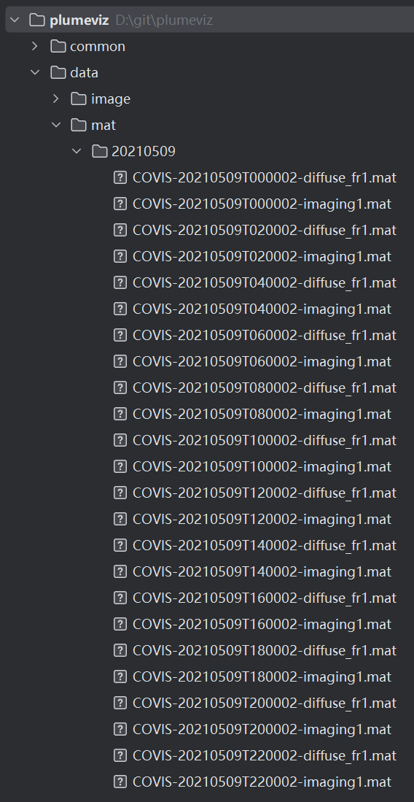

# PlumeViz

An interactive system for exploring multi-facet features of hydrothermal plumes in sonar images.

Project Home Page: https://syming123.github.io/plumeviz/


## Requirements

```text
Python
```


## Environment

```text
pip install -r requirements.txt
```


## Data

COVIS data from 2018 to 2023 can be download from http://piweb.ooirsn.uw.edu/covis/

COVIS data from 2010 to 2015 can be download from https://data.oceannetworks.ca/DataSearch?treeType=17&siteDevice=117782


## Run

```python
preprocessing tool: preprocessing/builder.py
visualization tool: visualization/main.py
```


## Example

This is a example about how to run PlumeViz

#### Download Data

Go to the website mentioned before and download the COVIS data.


 COVIS data include three kind of data: imaging, diffuse, doppler. Doppler data can only be downloaded for data from 2010 to 2015. To make sure preprocessing tool work well, you should download all needed data in a full day. In this case we download all imaging and diffuse data on May 9th, 2021, and we put them on a single folder. ( We don't need to download doppler data because it's missing from 2018 to 2023.)



#### Preprocessing

Open ./preprocessing/builder.py file and modify the code in main function to align your file path. In this case, We use the following code to implement data preprocessing:

```python
if __name__ == '__main__':
	build_all('../data/mat/20210509', '../data/processed/20210509')
```

Then, run this code. Data preprocessing will be done automatically.

#### Visualization

Run ./visualization/main.py 

After preprocessing phase, you will get index.bin in your target path. Click File->Add button to load this index file.

Note that due to the absence of doppler data for 2018-2023, it is not possible to calculate the plume velocity and heat flux for these years. Only data from 2010-2015 are available to view plume velocity and heat flux.


