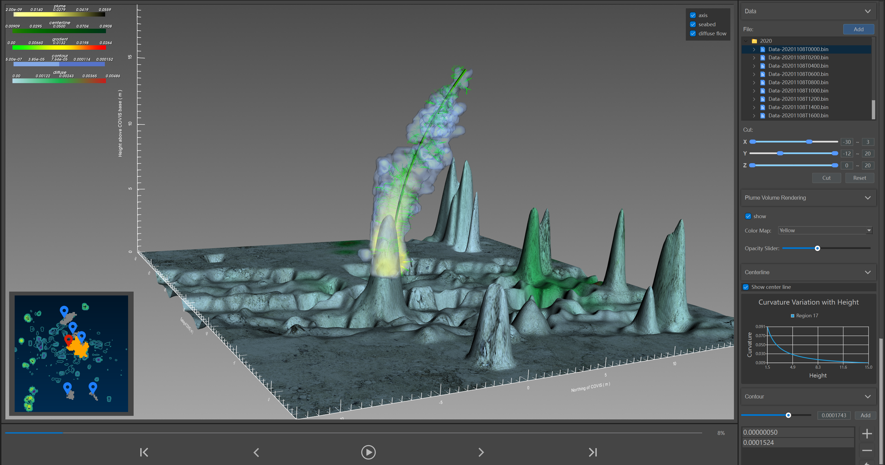
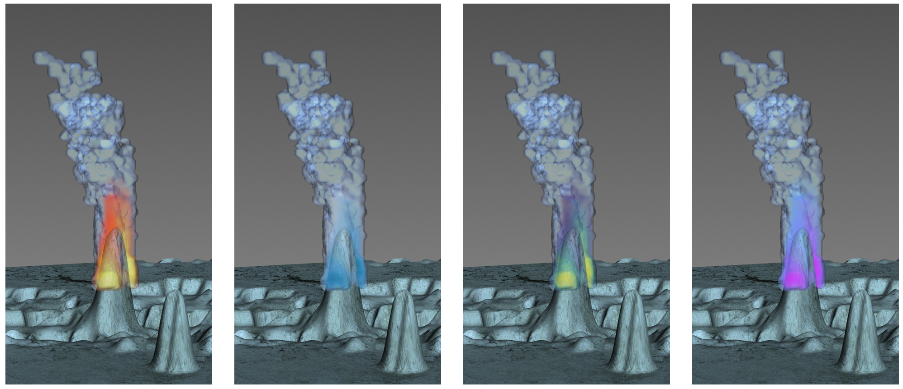

# PlumeViz

An interactive system for exploring multi-facet features of hydrothermal plumes in sonar images







## Requirements

```text
Python 3.12
```


## Environment

```text
pip install -r requirements.txt
```


## Run

```python
python main.py
```

