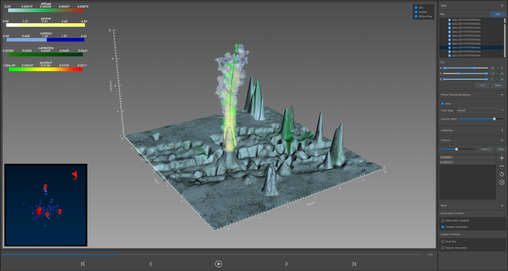

# PlumeViz

An interactive system for exploring multi-facet features of hydrothermal plumes in sonar images.

Project Home Page: https://syming123.github.io/plumeviz/




## Introducetion

This is our entry for SciVis Contest 2024. More detailed information about this contest can be found at: https://sciviscontest2024.github.io/


## Environment

```
pip install -r requirements.txt
```


## Download Data

COVIS data from 2018 to 2023 can be download from http://piweb.ooirsn.uw.edu/covis/

COVIS data from 2010 to 2015 can be download from https://data.oceannetworks.ca/DataSearch?treeType=17&siteDevice=117782


COVIS dataset include three kind of data: imaging, diffuse and doppler. Doppler data can only be downloaded for data from 2010 to 2015. To make sure preprocessing tool work well, you should download all needed data in a full day and put them in a single folder for preprocessing.


## Run

preprocessing:

```
cd preprocessing
python builder.py -i <input_dir> -o <output_dir>
```

visualization:

```
cd visualization
python main.py
```


